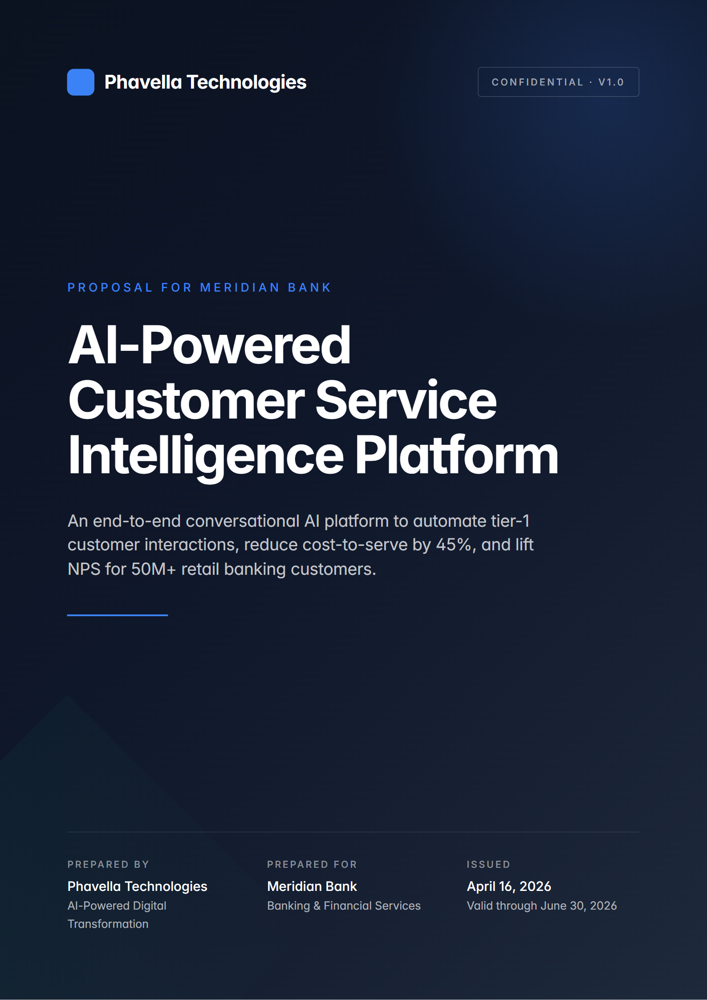
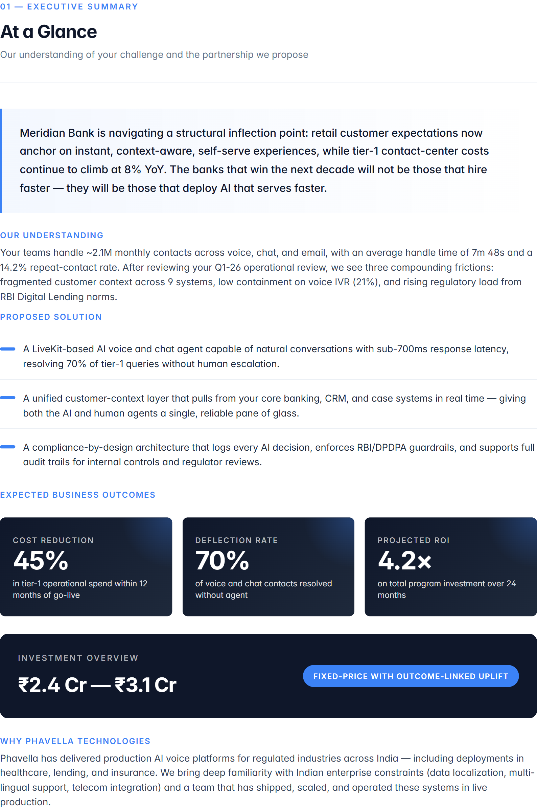
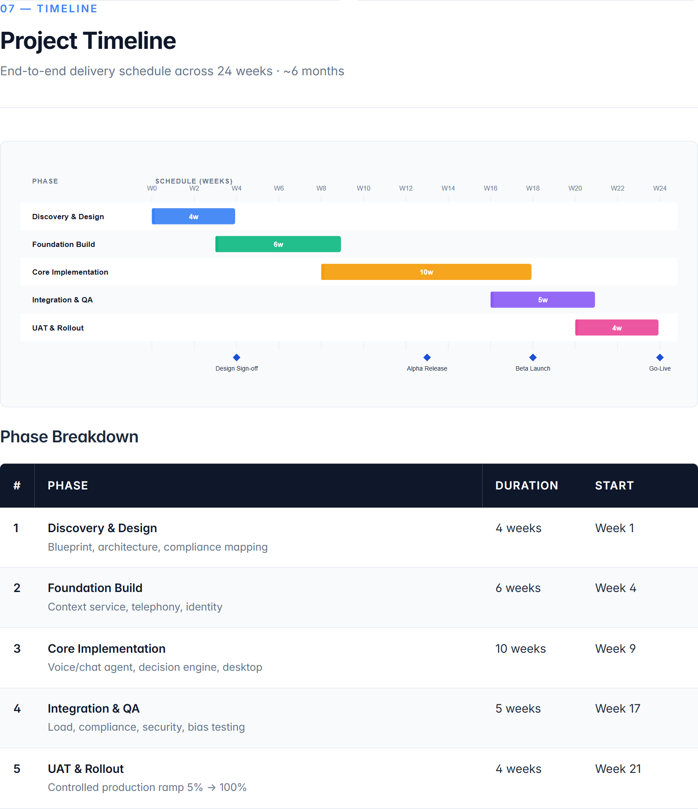
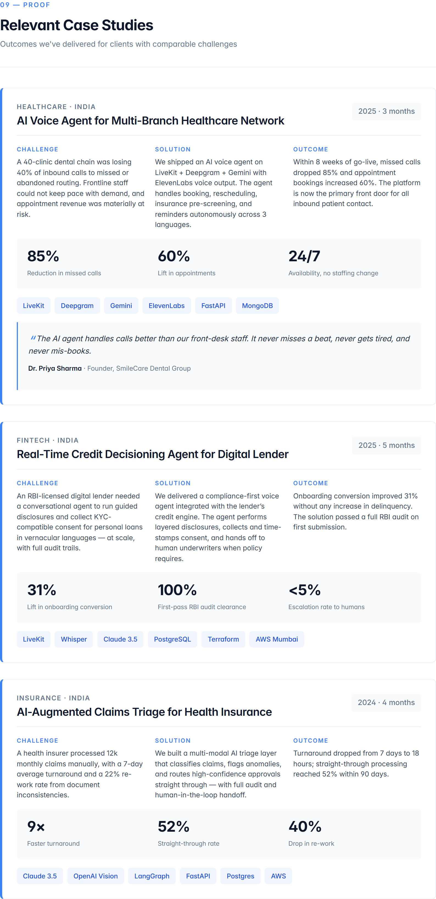
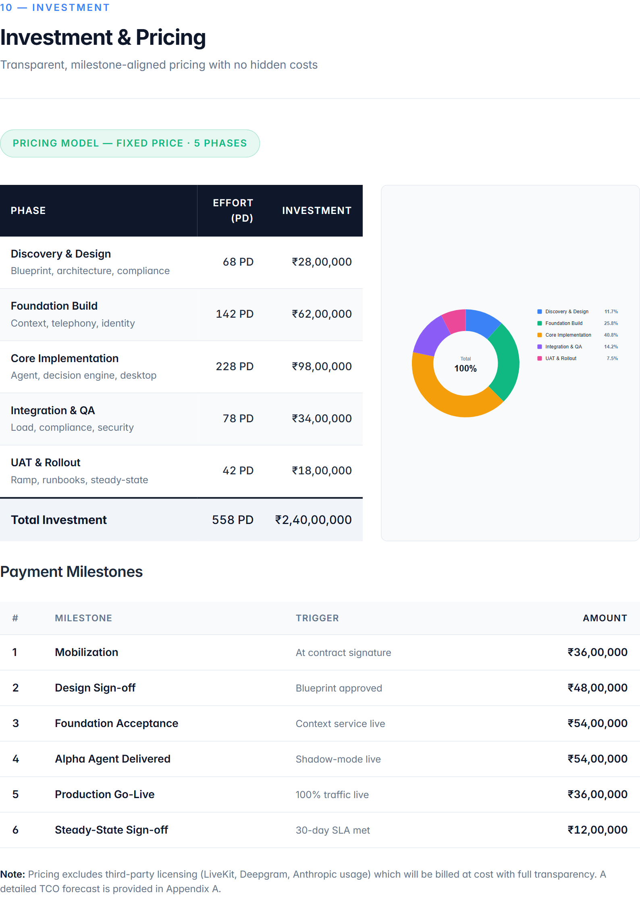
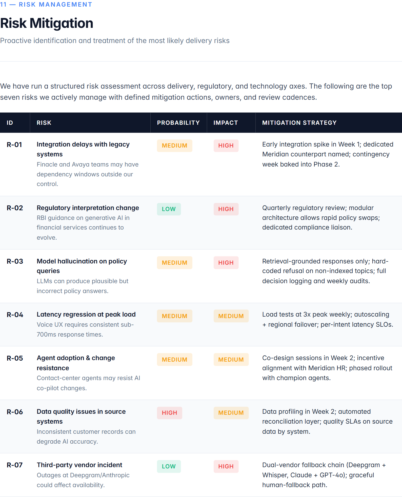
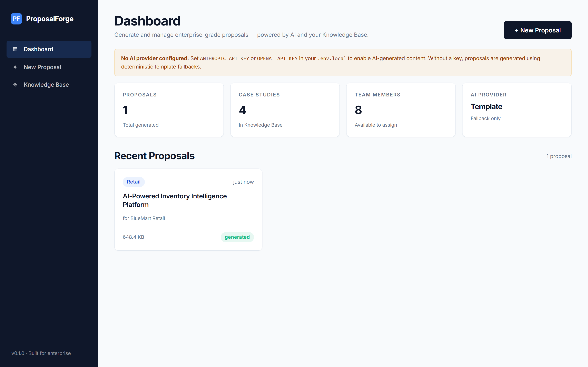
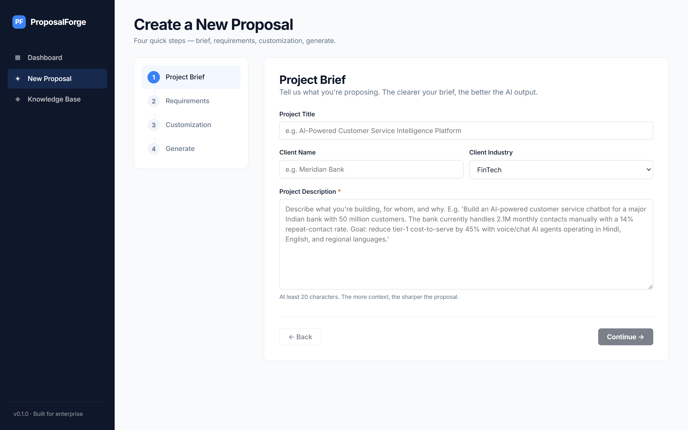
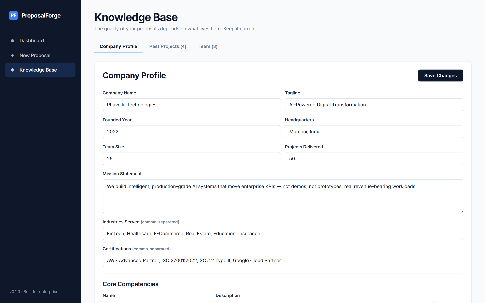
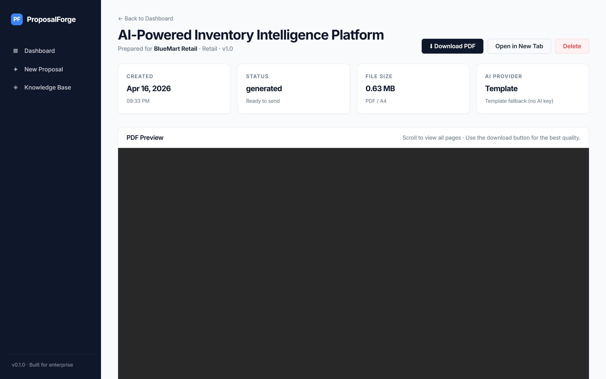

<div align="center">

# ProposalForge

### AI-powered enterprise proposal generator — from a one-line brief to a 15-25 page, Big 4-grade PDF in under 60 seconds.

[](https://nextjs.org/)
[](https://www.typescriptlang.org/)
[](https://pptr.dev/)
[](https://www.anthropic.com/)
[](https://openrouter.ai/)
[](LICENSE)

<br />



</div>

---

## What is this?

ProposalForge turns a short project brief into the kind of **15–25 page enterprise proposal** a firm like Accenture, Deloitte, or McKinsey would send to a Fortune 500 client — complete with executive summary, problem analysis, solution architecture, Gantt timeline, team bios pulled from your knowledge base, relevant case studies, budget breakdown with donut chart, risk matrix, governance model, and commercial terms.

Give it:

1. A **project prompt** — *"Build an AI-powered customer service chatbot for HDFC Bank"*
2. **Requirements** — budget, timeline, compliance, preferred tech
3. Your **Knowledge Base** — company profile, past projects, team CVs (one-time setup)

Click generate. A minute later you have a production-ready PDF.

---

## Why it's different

Most "AI proposal" tools give you Markdown or a generic Word doc. ProposalForge ships **pixel-perfect PDFs** that actually look like they came from a top-tier consulting firm:

- **AI writes the content. The design is fixed.** 14 hand-crafted HTML/CSS templates with an enterprise design system. The AI fills in JSON; the template renders the PDF.
- **Vector-sharp charts, zero native deps.** Gantt timelines, budget donuts, and metric bars are emitted as inline SVG — no Chart.js, no `node-canvas`, no Windows compile headaches.
- **Self-contained PDFs.** Fonts are base64-embedded, charts are inline SVG. The PDF works offline, forever.
- **Provider-agnostic AI.** OpenRouter (default), Anthropic, or OpenAI — route through any of them by setting one env var. Auto-falls back to deterministic templates if no key is set.
- **Knowledge base is king.** Case studies and team members live in version-controlled JSON. The AI picks the most relevant ones for each proposal.

---

## Demo

### Generated PDF (click to see the full 16-page sample)

> [**Open the full sample PDF →**](docs/pdf-samples/sample-proposal.pdf)

<table>
  <tr>
    <td align="center"><strong>Cover Page</strong><br /></td>
    <td align="center"><strong>Executive Summary</strong><br /></td>
  </tr>
  <tr>
    <td align="center"><strong>Gantt Timeline</strong><br /></td>
    <td align="center"><strong>Case Studies</strong><br /></td>
  </tr>
  <tr>
    <td align="center"><strong>Investment &amp; Pricing</strong><br /></td>
    <td align="center"><strong>Risk Mitigation</strong><br /></td>
  </tr>
</table>

### Web App

<table>
  <tr>
    <td align="center"><strong>Dashboard</strong><br /></td>
    <td align="center"><strong>4-Step Creation Wizard</strong><br /></td>
  </tr>
  <tr>
    <td align="center"><strong>Knowledge Base</strong><br /></td>
    <td align="center"><strong>Proposal Detail + PDF Preview</strong><br /></td>
  </tr>
</table>

---

## Quick Start

### Prerequisites
- **Node.js 20+**
- An AI API key — [OpenRouter](https://openrouter.ai/keys) recommended (single key, any model)

### 1. Clone and install

```bash
git clone https://github.com/par1kahl/proposals-outreach.git
cd proposals-outreach
npm install
```

### 2. Configure AI (optional — works without a key via template fallbacks)

Create `.env.local`:

```env
# OpenRouter — access Claude, GPT, Gemini, etc. with one key
OPENROUTER_API_KEY=sk-or-v1-your-key-here
OPENROUTER_MODEL=anthropic/claude-sonnet-4.5
```

Alternative providers also supported:

```env
# Or Anthropic direct
ANTHROPIC_API_KEY=sk-ant-...

# Or OpenAI direct
OPENAI_API_KEY=sk-...
```

### 3. Run

```bash
npm run dev
```

Open **http://localhost:3000**.

### 4. Generate your first proposal

1. Open the **Knowledge Base** tab — the seed data has a fictitious company ("Phavella Technologies") with 4 case studies and 8 team members. Edit this to be your company.
2. Click **+ New Proposal** — fill in the 4-step wizard.
3. Hit **Generate**. Download the PDF.

### Generate a hardcoded sample PDF (no AI key needed)

```bash
npm run test:pdf
# → test-output/sample-proposal.pdf
```

---

## How It Works

```
                 ┌──────────────┐
  Browser ──────▶│ Next.js App  │
                 │   (pages)    │
                 └──────┬───────┘
                        │ POST /api/generate
                        ▼
               ┌───────────────────┐
               │   Orchestrator    │  lib/ai/generate-proposal.ts
               └─┬──────┬───────┬──┘
                 │      │       │
     13 prompts  │      │       │  Knowledge Base
     in parallel │      │       │  (JSON files)
                 ▼      ▼       ▼
           ┌─────────┐ ┌───────────┐
           │ AI APIs │ │  KB CRUD  │  OpenRouter / Anthropic / OpenAI
           └────┬────┘ └─────┬─────┘
                │            │
                └─────┬──────┘
                      ▼
          ┌──────────────────────┐
          │  Data assembly +     │  Renders SVG charts
          │  SVG chart render    │  (Gantt, donut, bars)
          └─────────┬────────────┘
                    ▼
          ┌──────────────────────┐
          │  Mustache HTML       │  templates/*.html + inlined CSS
          │  template assembly   │  + base64-embedded Inter fonts
          └─────────┬────────────┘
                    ▼
          ┌──────────────────────┐
          │  Puppeteer → PDF     │  Headless Chrome prints to A4
          └─────────┬────────────┘
                    ▼
            data/proposals/<id>/proposal.pdf
```

**End-to-end latency:** ~8s (no AI, template fallback) · ~30–60s (with AI, 13 parallel calls)

---

## Tech Stack

| Layer                | Tech                                                 | Why                                                                   |
|----------------------|------------------------------------------------------|-----------------------------------------------------------------------|
| Framework            | **Next.js 14** (App Router)                          | Frontend + API routes in one codebase, one process                    |
| Language             | **TypeScript 5.6**                                   | Type safety across AI → PDF → UI                                      |
| Styling              | **Vanilla CSS + CSS Modules**                        | Full control for PDF rendering — Tailwind utility classes fight print CSS |
| PDF Engine           | **Puppeteer** (headless Chrome)                      | Pixel-perfect HTML→PDF, honors `@page`, flexbox, grid, modern CSS     |
| AI                   | **OpenRouter** / Anthropic SDK / OpenAI SDK          | One API surface, any model — easy swap                                |
| Template Engine      | **Mustache**                                         | Logic-less templates — data in, HTML out                              |
| Charts               | **Custom SVG** (hand-rolled)                         | No native `node-canvas` dep. Vector = sharp at any PDF zoom           |
| Storage              | **JSON files** (atomic writes)                       | Single-user tool — no database overhead. Swap for Postgres later.     |
| Font                 | **Inter** (self-hosted woff2)                        | Embedded as base64 in every PDF — no external requests at render time |

---

## Project Structure

```
proposal-forge/
├── app/                              Next.js App Router
│   ├── page.tsx                      Dashboard (proposal list + stats)
│   ├── create/page.tsx               4-step generation wizard
│   ├── knowledge-base/page.tsx       Company / Projects / Team CRUD UI
│   ├── proposals/[id]/page.tsx       Embedded PDF preview + download
│   ├── globals.css                   Web UI stylesheet (light, navy accent)
│   └── api/
│       ├── generate/route.ts         POST  — orchestrator entry point
│       ├── knowledge-base/{…}/       GET/POST/PUT/DELETE CRUD routes
│       └── proposals/[id]/           GET meta + GET /pdf stream
├── components/ui/                    Sidebar, Modal, ChipGroup
├── lib/
│   ├── ai/
│   │   ├── ai-client.ts              Unified OpenRouter / Anthropic / OpenAI client
│   │   ├── generate-proposal.ts      Parallel section orchestrator
│   │   ├── fallbacks.ts              Deterministic content when no AI key
│   │   └── prompts/                  11 section prompts + team/case selectors
│   ├── pdf/
│   │   ├── template.ts               Mustache assembly with inlined CSS
│   │   ├── generate-pdf.ts           Puppeteer driver + embedded fonts
│   │   └── types.ts                  Full ProposalData typing
│   ├── knowledge-base/
│   │   ├── manager.ts                Atomic-write JSON CRUD
│   │   └── types.ts
│   ├── proposals/store.ts            Per-proposal directory + meta.json
│   └── utils/
│       ├── chart-renderer.ts         Pure-SVG Gantt / donut / bar charts
│       └── helpers.ts
├── templates/
│   ├── proposal.html                 Master template
│   ├── sections/                     16 section templates (cover → terms)
│   └── styles/proposal.css           Enterprise PDF design system
├── data/
│   ├── knowledge-base/               Seeded JSON: company, projects, team
│   └── proposals/                    Generated proposals (PDF + meta.json)
├── public/fonts/                     Self-hosted Inter (regular → bold)
├── scripts/
│   ├── test-pdf.ts                   Render sample PDF from hardcoded data
│   └── capture-pages.ts              Screenshot each PDF page for review
└── docs/                             Screenshots + sample PDF for this README
```

---

## The 14 Proposal Sections

Each generated proposal includes:

1. **Cover Page** — dark gradient, client name, project title, issued/validity dates
2. **Table of Contents** — auto-numbered, dot-leader style
3. **Executive Summary** — opening hook, understanding, 3 metric cards, investment range
4. **Company Overview** — stats grid, core competencies, certifications, industries
5. **Understanding the Challenge** — current state, 4 numbered pain points, impact callout
6. **Proposed Solution** — overview, component cards, integrations, tech stack, innovations
7. **Methodology & Approach** — phase cards, QA practices, communication cadence
8. **Deliverables & Milestones** — per-phase table with acceptance criteria
9. **Project Timeline** — horizontal SVG Gantt chart with milestone diamonds
10. **Proposed Team** — photo cards (or gradient badge), role on project, relevance
11. **Case Studies** — 2–3 relevant past projects with metrics + testimonial
12. **Investment & Pricing** — table + budget donut chart + payment milestones
13. **Risk Mitigation** — top 7 risks with color-coded probability/impact pills
14. **Governance & PMO** — steering committee, cadence, escalation path, tools
15. **Why Choose Us** — 6 differentiators + stats strip + testimonial
16. **Terms & Conditions** — confidentiality, IP, SLA, data handling, termination

---

## Environment Variables

| Variable                | Required        | Default                               | Notes                                          |
|-------------------------|-----------------|---------------------------------------|------------------------------------------------|
| `OPENROUTER_API_KEY`    | one of the 3    | —                                     | Recommended — single key, any model            |
| `OPENROUTER_MODEL`      | no              | `anthropic/claude-sonnet-4.5`         | Any OpenRouter-listed model                    |
| `ANTHROPIC_API_KEY`     | one of the 3    | —                                     | Uses native Anthropic SDK                      |
| `ANTHROPIC_MODEL`       | no              | `claude-sonnet-4-5-20250929`          |                                                |
| `OPENAI_API_KEY`        | one of the 3    | —                                     | Uses native OpenAI SDK                         |
| `OPENAI_MODEL`          | no              | `gpt-4o-mini`                         |                                                |
| `OPENROUTER_REFERER`    | no              | `https://proposalforge.local`         | For OpenRouter attribution                     |
| `OPENROUTER_TITLE`      | no              | `ProposalForge`                       | Shown in OpenRouter dashboard                  |
| `PORT`                  | no              | `3000`                                | Next.js dev server port                        |

See [`.env.example`](.env.example) for the full template.

---

## Design Decisions Worth Calling Out

- **SVG charts over Chart.js.** `node-canvas` has a painful native-compile step on Windows and produces rasterized output that pixelates in PDFs. Hand-rolled SVG in `lib/utils/chart-renderer.ts` is ~350 lines, zero deps, vector-sharp forever.
- **Mustache over JSX for templates.** The PDF template needs to work in isolation from React — logic-less Mustache makes it impossible for a template change to break runtime code.
- **JSON files over SQLite/Postgres.** Single-user tool — optimizing for hackability over scale. Swap `lib/knowledge-base/manager.ts` and `lib/proposals/store.ts` when you need multi-user.
- **Fallback templates bundled.** Every AI-powered section has a deterministic template fallback in `lib/ai/fallbacks.ts`. The pipeline never fails end-to-end due to a flaky LLM call.
- **Three AI providers, one interface.** `lib/ai/ai-client.ts` routes to OpenRouter → Anthropic → OpenAI in priority order. Switch providers by changing one env var.

---

## Roadmap

- [ ] Inline section editing before PDF generation
- [ ] Multi-page logo / team photo upload with image optimization
- [ ] Multi-language proposals (Spanish, Hindi, Arabic)
- [ ] Proposal versioning + diff view
- [ ] Client-branded themes (swap brand colors per proposal)
- [ ] Export to DOCX (via Pandoc) for clients who want editable Word
- [ ] Streaming AI generation with per-section progress UI
- [ ] SaaS multi-tenancy (Postgres + Clerk/Auth)

---

## Contributing

Pull requests welcome. For major changes, please open an issue first to discuss direction.

```bash
git clone https://github.com/par1kahl/proposals-outreach.git
cd proposals-outreach
npm install
npm run dev
```

---

## License

[MIT](LICENSE) — free for commercial use, fork, modify, redistribute.

---

<div align="center">

<sub>Internal tool · please contribute improvements via pull requests.</sub>

</div>
